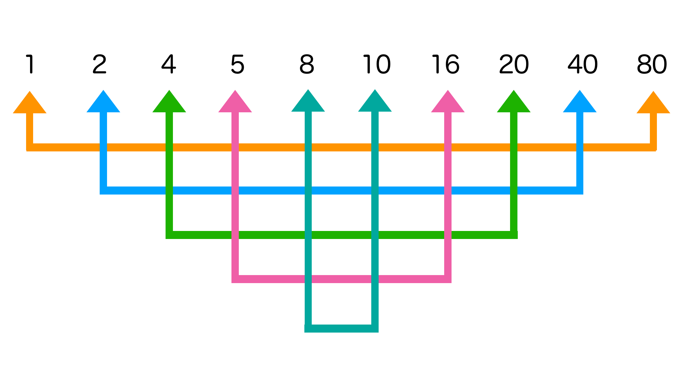

# Finding Devisors - Algorithm Simplification

***Last edit: 22:56:24 2/7/2019***

What would you do if you want to find all devisors of a number?

----

## 1. Search One By One

The first question is: what is a devisor? In short, if a number can be divided with no remainder by another number, and the second number is less greater than the first number, then the second number is a divisor of the first number. For example, 10 % 2 = 5 ... 0, therefore, 2 is a divisor of 10.

Based on it's definition, we can easily come up with this method.

    for numberCounter in range(1, inputNumber + 1):
        if inputNumber % numberCounter == 0:
            print(numberCounter, "is a divisor of", inputNumber)

## 2. Cut in Half

The problem with the method below is that it's time consuming. Let's take a look at this graph:

It isn't hard to tell that a divisor of a number besides itself can't be greater than half the value of the number. For example, the second greatest divisor of 64 is 32, the second greatest divisors of 28 is 14, the second greatest divisor of 9 is 3.

Therefore, we can simply search from 1 to half the value of the number.

    for numberCounter in range(1, int(inputNumber/2 + 1)):
        if inputNumber % numberCounter == 0:
            print(numberCounter, "is a divisor of", inputNumber)
    print(inputNumber, "is a divisor of", inputNumber)

## 3. Find a Match, Stop at Square Root

Yet, we can make the algorithm even quicker.

Had you noticed the divisors of a number, you'll se that divisors always comes in pairs. In another word, you can always get a number from the product of its two divisors. If you have known got a divisor, you can easily get another divisor by **the number / the divisor**.