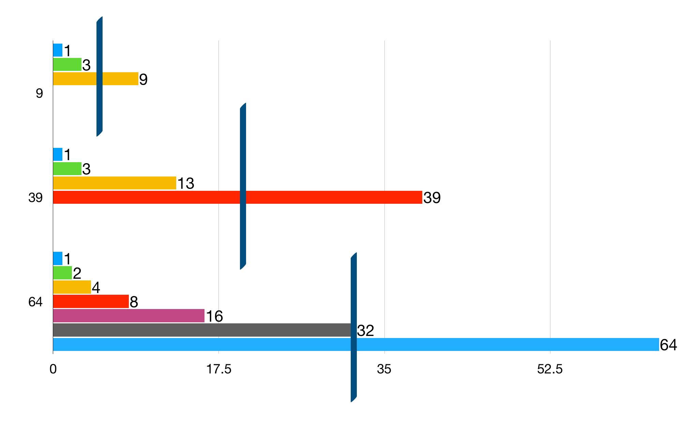

# Finding Devisors - Algorithm Simplification 

**Last edit: 16:04:49 2/5/2019***

What would you do if you want to find all devisors of a number?

----

## 1. Search One By One

The first question is: what is a devisor? In short, if a number can be divided with no remainder by another number, and the second number is less greater than the first number, then the second number is a divisor of the first number. For example, 10 % 2 = 5 ... 0, therefore, 2 is a divisor of 10.

Based on it's definition, we can easily come up with this method.

	for numberCounter in range(1, inputNumber):
		if inputNumber % numberCounter == 0:
			print(numberCounter, "is a divisor of", inputNumber)

## 2. Cut in Half

The problem with the method below is that it's time consuming. Let's take a look at this graph:

