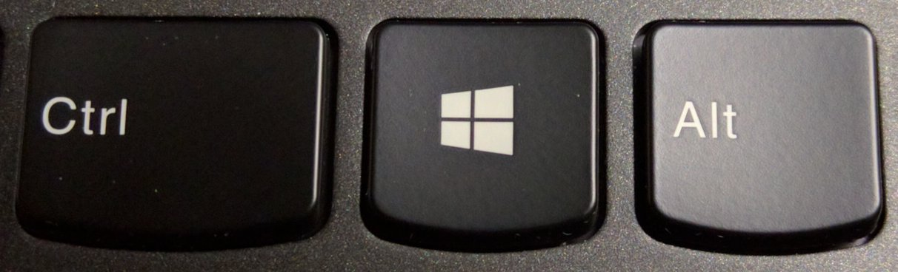
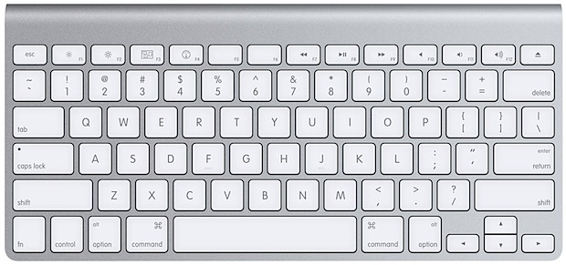
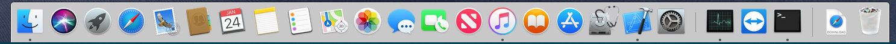
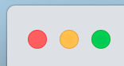
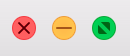
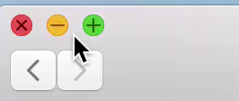

# A Journey to macOS

***Last edit: 13:06:51 1/26/2019***

For reasons I don't feel like telling, now I'm able to use macOS, and I'll be using it constantly in the near future. It's quite important for me to get familiar with this operating system, which is quite different from Windows. So, I'll lay out some **non-technical** but valuable differences that I think a macOS beginner like me could really use.

----

## 1. Keyboard

The difference between Windows and macOS reveals on their hardwares. For instance, there are keys with different names on their keyboards.

Windows Keyboard:

> 

Mac Keyboard:

> 

| Windows | Mac |
| :---- | ----: |
| Ctrl | ⌃(control) |
| Windows | ⌘(command) |
| Alt | ⌥(option) |
| Enter | ↩(return) |
| *Backspace* | *delete* |

*Do note that the **Delete key on Windows Computers** is different from the **Delete Key on Macintosh Computers**.* 

*On Windows, "Backspace" deletes content **before** the text cursor while "Delete" deletes content **after** the text cursor.* 

*On a Macintosh computer, the "delete" key deletes content **before** the text cursor. In order to delete afterward, you could try **fn + delete**. You can also delete everything after the text cursor with **fn + ⌥(option) + delete**.* 

    Irrelevent to the topic, here also some keys with logos:

    ⇧(shift), ⇪(caps lock), ⌅(enter).

## 2. Dock and Menu Bar

### Dock

The thing on the buttom of your computer screen with a lot of icons on it is called "Dock".

> 

The Dock functions similarly to the APP part of task bar in Windows where. This is the place where you could quickly run apps and see what is currently running. 

One of the differences between Dock and task bar in Windows that you should probably take notice of is that, unlike task bar in Windows, any program that is running on the screen is not displayed on the (relevantly) right side of dock, unless you dock it by pressing the "minimize" button.

### Menu Bar

The menu bar locates on the top of your computer screen. 

> 

The Apple logo on the left side and these icons and the clock on the right side stay the same no matter what program you are currently running. From the Apple logo you can check out infomation about your computer and shut down your computer. The right side where these icons are is similar to the system tray in Windows.

The menu being in the middle on the top of the screen is one of macOS's characteristics. The menu varies with the program you are currently using. On macOS, the menu bar is on the top of the screen while on Windows, the menu bar is usually below the title bar of a window.

## 3. Maximization, Split View

You must be really familiar with these three buttons on the **upper right side** of a window on Windows.

> 

From left to right, they are "minimize", "maximize", "close". By clicking them you can do these things to a window.

Things are quite different on macOS. First of all, these three buttons are on the **upper left side** of a window. You'll see nothing on the upper right side.

> 

Second, at the first glance of them, you may see something similar to traffic lights.🚥

> 

Put the pointer close to these buttons, and take a guess, what are they? You can probably tell that the first button stands for "close" and the second button means "minimize", but you might be mistaken because the third button doesn't work as "maximize" button on Windows.

Yes, the definition of "maximization" on macOS is different from what's on Windows. If you click the button where you though "maximize" should be, you will see the window at **fullscreen**.

However, if you hold **⌥(option)** and move your mouse pointer near the three buttons, you'll see the fullscreen button turn into a "plus".

> 

What would happen if you click the "plus" button? Well, the button means to zoom the window into **"the most appropriate size"**. Some windows might be maximized as that in Windows, occupying the screen except for the dock and the menu bar. Others may simply be larger or smaller, you'll still get to see the desktop.

You can also resize a window to the most appropriate size by clicking the title bar twice.

## 4. Copy, Cut, Paste, Move, Duplicate, Alias

You can copy, cut, and paste sentences in Windows with Ctrl and C/X/V. You can do the same on macOS with **⌘(command)** and C/X/V.

When it comes to files, you can copy and paste files the way  that you do to sentences, but you cannot cut(move) files with ⌘(command) + X.

## 5. Installing a Program

----

## References

1. Photo [Touche_Windows_8_10](https://en.m.wikipedia.org/wiki/Windows_key#/media/File%3ATouche_Windows_8_10.jpg), from [Windows Key - Wikipedia](https://en.m.wikipedia.org/wiki/Windows_key). Retrieved in January, 23, 2019.

2. Photo [mac-keyboard](http://cdn.osxdaily.com/wp-content/uploads/2012/02/mac-keyboard.jpg), from [12 Keyboard Shortcuts for Navigating & Selecting Text in Mac OS X](http://osxdaily.com/2012/02/23/keyboard-shortcuts-to-navigate-select-text-mac-os-x/). Retrieved in January, 23, 2019.