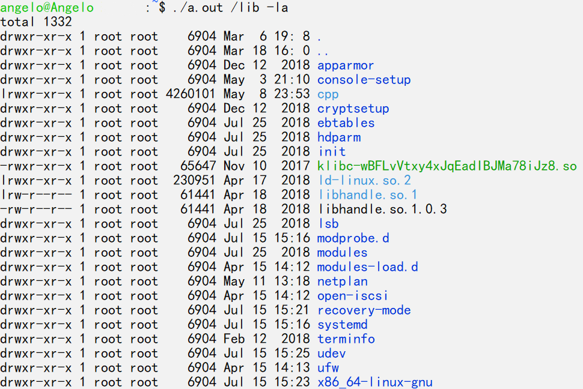

# To Create a Simplified Version of *`ls`*

***Last edit: 15:09:22 7/26/2019***

So, I wrote a simplified version of the famous command `ls` in C++.

---

## Introduction

> `ls`: List information about the FILEs.

If you haven't heard about `ls` before, which you shouldn't, here's what it looks like.

As for mine, take a look.

You can get its source code [here](https://github.com/AngeloHYang/hello-worldpp/blob/master/ls.cpp).

## Functions

To write a program like that in C++, here are some functions I find helpful.

Functions | Usage | Notes
---- | ---- | ----
`DIR * opendir(const char * name)` | To open directory `name` and return a `directory stream` | Similar to `fopen()`
`struct dirent * readdir(DIR * dir)` | To return the `entry` (in a struct dirent pointer to) of the next directory of the stream | Similar to `fread()`
`int closedir(DIR *dir)` | To close the `directory stream` | Similar to `fclose()`
`int stat(const char *path, struct stat *buf)` | Return information about a file
`struct passwd *getpwuid(uid_t uid)` | To return a pointer to a passwd structure
`struct group *getgrgid(gid_t gid)` | To return a pointer to a group structure

### 1. `DIR * opendir(const char * name)`, `struct dirent * readdir(DIR * dir)`, `int closedir(DIR *dir)`

To use these three functions above, you need to include `sys/types.h` and `dirent.h`.

`DIR*` works similarly as `FILE*`. To open a directory stream, like the way you open a file stream, you may invoke `DIR * opendir(const char * name)`.

Assume that you are going to open `home`:

    DIR* theDirectory = opendir("~");

If the attempt to open a directory fails, the function will return `NULL`.

To get a file(entry) from the directory stream, you can invoke `struct dirent * readdir(DIR * dir)`.

Here's what `struct dirent` looks like:

    struct dirent {
        ino_t          d_ino;       /* Inode number */
        off_t          d_off;       /* Not an offset; see below */
        unsigned short d_reclen;    /* Length of this record */
        unsigned char  d_type;      /* Type of file; not supported by all filesystem types */
        char           d_name[256]; /* Null-terminated filename */
    };

These items are self-evident, aren't they?

To get a pointer about a file to this struct, you should:

    while (struct dirent* theFile = readdir(theDirectory))
    {
        doSomething();
    }

If the end of the directory is reached or if something goes wrong, `NULL` will be returned.

You can close a file stream with `int fclose (FILE * stream)`, and you can close a directory stream with `int closedir(DIR *dir)`.

The `closedir()` function returns 0 on success. On error, -1 is returned.

### 2. int stat(const char *path, struct stat *buf)

This is the function that allows you to get the detailed information of a file from `buf`. You need to include `sys/types.h>`, `sys/stat.h`, `unistd.h`.

What is struct stat?

    struct stat 
    {
        dev_t     st_dev;         /* ID of device containing file */
        ino_t     st_ino;         /* inode number */
        mode_t    st_mode;        /* protection */
        nlink_t   st_nlink;       /* number of hard links */
        uid_t     st_uid;         /* user ID of owner */
        gid_t     st_gid;         /* group ID of owner */
        dev_t     st_rdev;        /* device ID (if special file) */
        off_t     st_size;        /* total size, in bytes */
        blksize_t st_blksize;     /* blocksize for filesystem I/O */
        blkcnt_t  st_blocks;      /* number of 512B blocks allocated */

        /* Since Linux 2.6, the kernel supports nanosecond precision for the following timestamp fields. 
        
        For the details before Linux 2.6, see NOTES. */

        struct timespec st_atim;  /* time of last access */
        struct timespec st_mtim;  /* time of last modification */
        struct timespec st_ctim;  /* time of last status change */

        #define st_atime st_atim.tv_sec      /* Backward compatibility */
        #define st_mtime st_mtim.tv_sec
        #define st_ctime st_ctim.tv_sec
    };

Feel free to check out all the comments.

Therefore, to get the information of a file, assume there's a text file in ~, all you need to do is:

    struct stat buffer;
    stat("~/a.txt", &buffer);

Then you'll be able to retrieve information from `buffer`.

### 3. Users and Groups

Though you can always check out users and groups' information from /etc/passwd and /etc/group, There are times when login information is stored on a NIS and not on your computer, or your information isn't up to date. Luckily there are library functions for us to invoke so that we won't have to worry about that.

They are `struct passwd *getpwuid(uid_t uid)` and `struct group *getgrgid(gid_t gid)`. Each of them requires `pwd.h`, `grp.h` separately.

`struct passwd` looks like:

    #include <pwd.h>
    struct passwd {
        char *pw_name;
        char *pw_passwd;
        uid_t pw_uid;
        gid_t pw_gid;
        time_t pw_change;
        char *pw_class;
        char *pw_gecos;
        char *pw_dir;
        char *pw_shell;
        time_t pw_expire;
    };

`struct group` looks like:

    #include <grp.h>
    struct group {
        char *gr_name;
        char *gr_passwd;
        gid_t gr_gid;
        char **gr_mem;
    };

To get the username from a UID, all you have to do is:

    struct passwd* theUser = getpwuid(uid);
    theUser->pw_name;

As for the name of a group:

    struct group* theGroup = getgrgid(gid);
    theGroup->gr_name;

If there's no result to be found, these two functions will return `NULL`.

## Arguments

Unlike programs like *Theater Ticket Management System(TTMS)*, this program doesn't require you to input anything when running. Instead, all of the user inputs are arguments alongside the command to run this program.

This is how you receive arguments in C/C++:

    int main(int argc, char** argv)
    {
        ;
    }

`int argc`(argument counter) stands for the number of your arguments, including the command to run program itself. `char** argv`(argument vector) stores the contents.

## The Program

The program consists of these functions above. When you run the program, it will separate parameters into filenames and options. To each filename the program will generate an object to store the entry to the file itself or it's subentries. As for the options, the program will split them up and detect how these data will be sorted, processed, or displayed.

---

## References

1. [Ls_command_result.png](https://commons.wikimedia.org/wiki/File:Ls_command_result.png), Jppizarro. Retrieved in July, 25, 2019.

---

## **[⇦ Previous: Binary Search](https://angelohyang.github.io/Blog/Feb.%202019/Binary%20Search)**

## **[⇨ Next: Variable in Java Enhanced For Statement](https://angelohyang.github.io/Blog/Dec.%202019/Java_For_Reference_or_Copy)**

## **[🏡 Back to Home Page](https://angelohyang.github.io/Blog/)**
